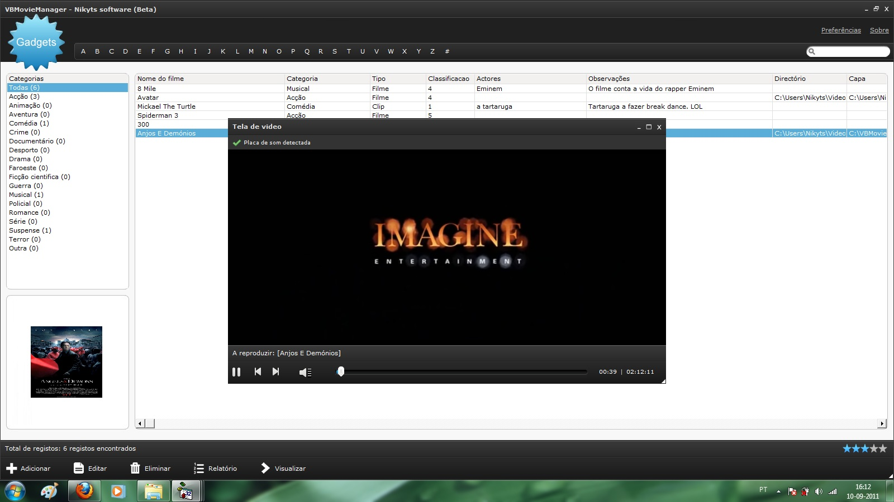



## VBMovieManager

### Description

Program to manage movies on your computer, with an option to view the films through the application itself. System in Portuguese
 
### More Info
 

             |
---                |---
**Submitted On**   |2012-02-26 20:53:00
**By**             |[Nikyts](https://github.com/Planet-Source-Code/PSCIndex/blob/master/ByAuthor/nikyts.md)
**Level**          |Intermediate
**User Rating**    |5.0 (15 globes from 3 users)
**Compatibility**  |VB 6\.0
**Category**       |[Databases/ Data Access/ DAO/ ADO](https://github.com/Planet-Source-Code/PSCIndex/blob/master/ByCategory/databases-data-access-dao-ado__1-6.md)
**World**          |[Visual Basic](https://github.com/Planet-Source-Code/PSCIndex/blob/master/ByWorld/visual-basic.md)
**Archive File**   |[VBMovieMan222093312012\.zip](https://github.com/Planet-Source-Code/nikyts-vbmoviemanager__1-74294/archive/master.zip)

